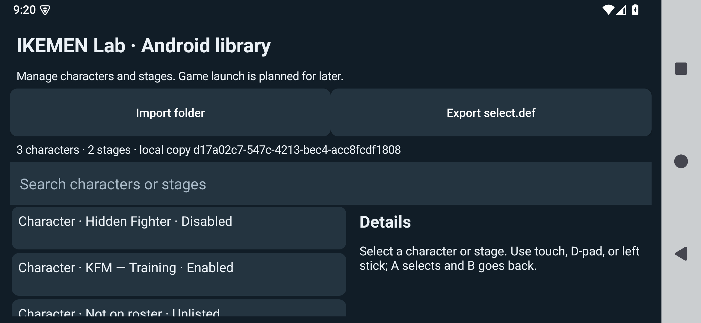
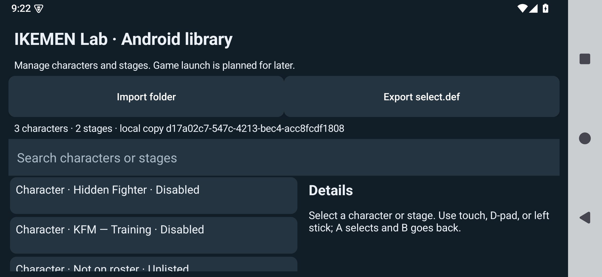
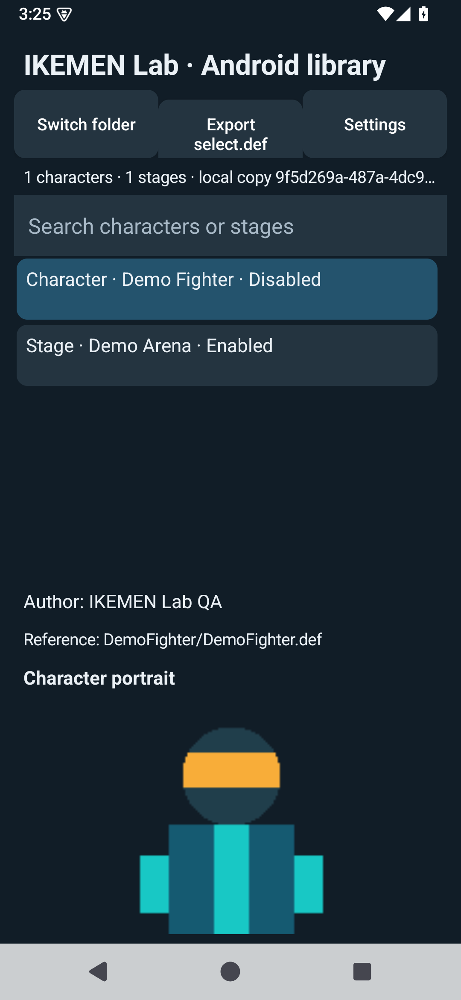
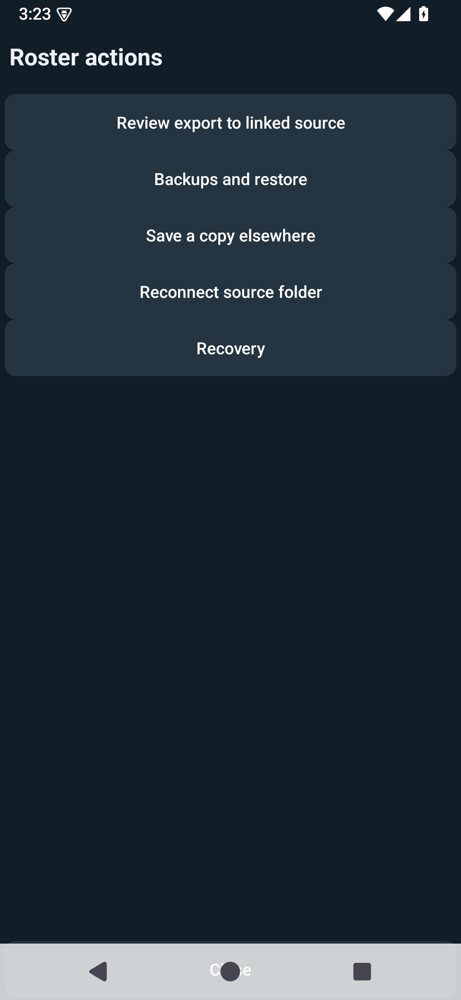
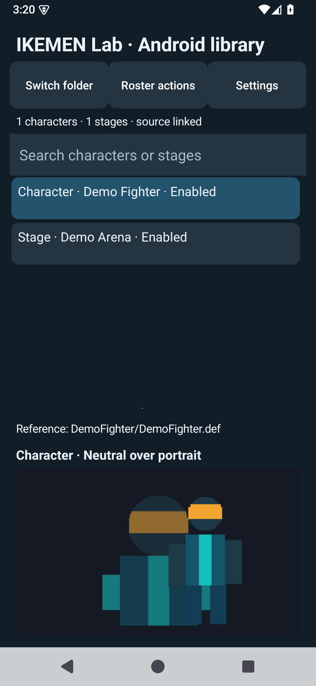
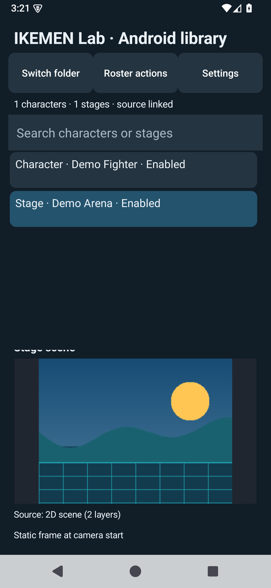
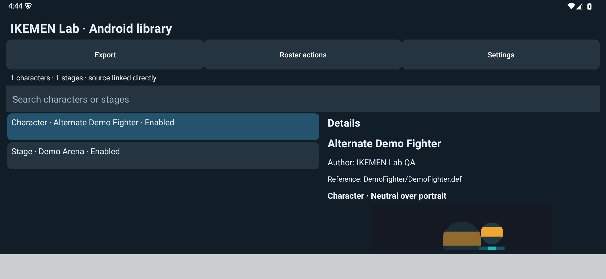
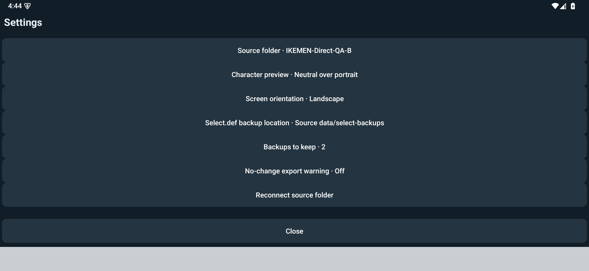
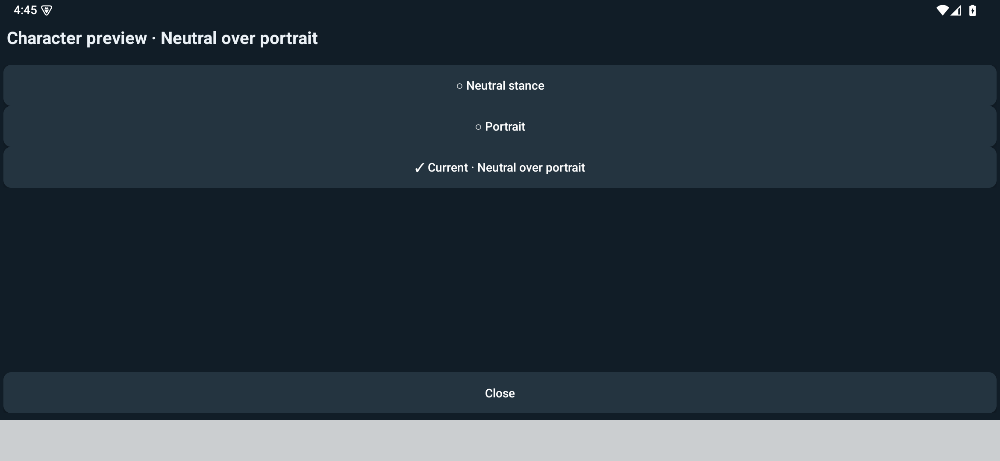

# Android screenshots

These screenshots use synthetic demonstration content created for this project. They show the Android app UI without distributing files from a user's game archive. The linked prerelease pages identify which image belongs to each version.

## 0.1.0

The first library browser in landscape mode.

## 0.2.0

The initial previews and Fighter Lab icon are also shown in the [character](android-v0.2.0-character.png), [stage](android-v0.2.0-stage.png), and [icon](android-v0.2.0-icon.png) screenshots.

## 0.3.0

The details pane stays visible in portrait mode, with character artwork below name, author, and reference.

## 0.4.0

Roster actions include export review, backups, restore, and recovery. The [export review](android-v0.4.0-export-review.png) shows its change summary and backup plan before overwriting `select.def`.

## 0.5.0

Choose neutral, portrait, or combined character artwork. The screenshot shows the combined setting.

A supported 2D stage shows a static composition of two background layers.

## 0.6.0 development candidate

These actual-app captures use a self-created demonstration library. They were captured from signed candidate `c0b38d9`; the later recovery-only correction does not change these screens. Version 0.6.0 has not been published.

The main library browser keeps **Export** visible beside Roster actions and Settings.

Settings shows the selected source, preview mode, orientation, backup destination, retention, and no-change warning.

The preview setting marks **Neutral over portrait** as the current choice with a checkmark and text.
