# Android screenshots

These screenshots use synthetic demonstration content created for this project. They show the Android app UI without distributing files from a user's game archive. The linked prerelease pages identify which image belongs to each version.

## 0.1.0

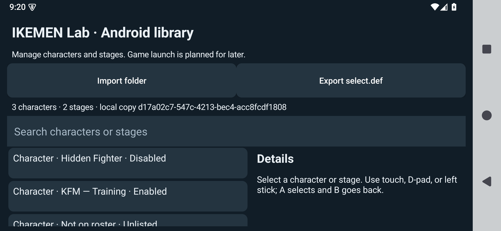

The first library browser in landscape mode.

## 0.2.0

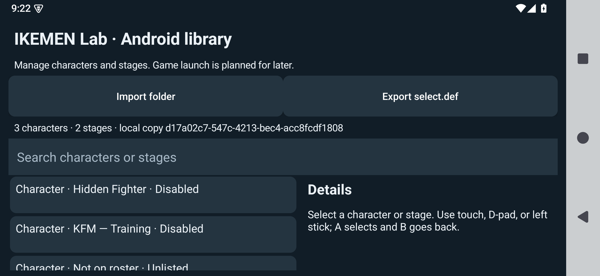

The initial previews and Fighter Lab icon are also shown in the [character](android-v0.2.0-character.png), [stage](android-v0.2.0-stage.png), and [icon](android-v0.2.0-icon.png) screenshots.

## 0.3.0

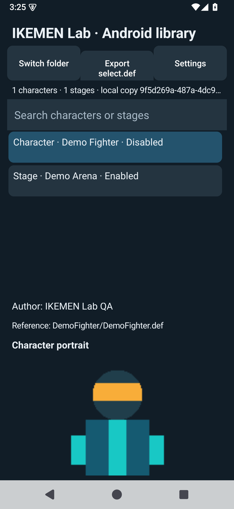

The details pane stays visible in portrait mode, with character artwork below name, author, and reference.

## 0.4.0

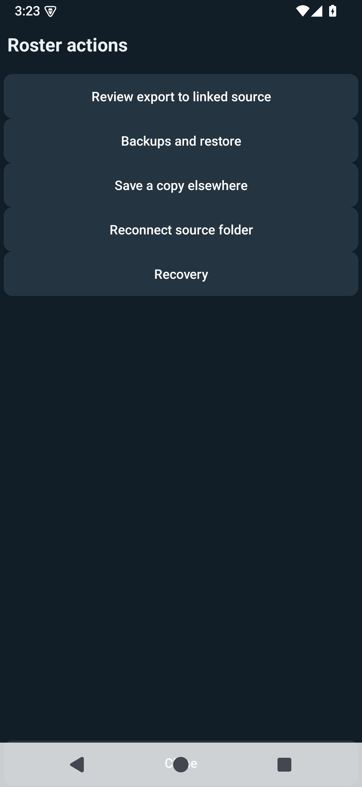

Roster actions include export review, backups, restore, and recovery. The [export review](android-v0.4.0-export-review.png) shows its change summary and backup plan before overwriting `select.def`.

## 0.5.0

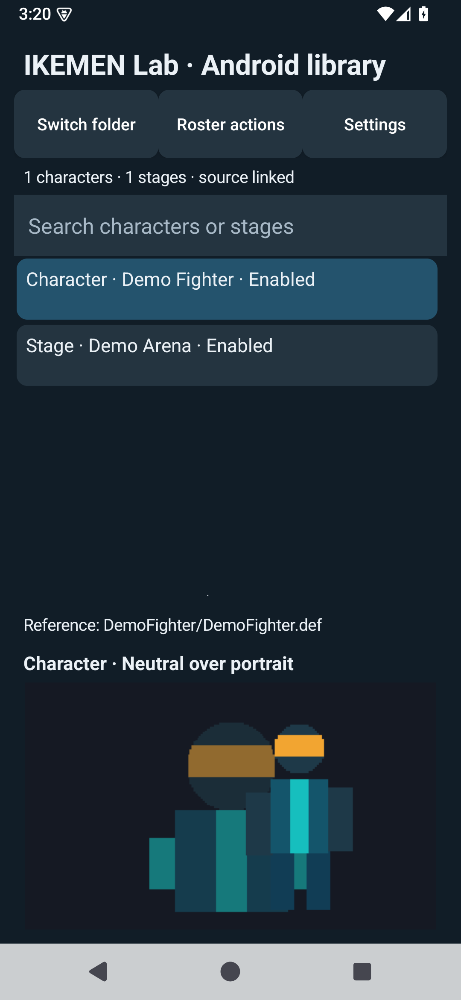

Choose neutral, portrait, or combined character artwork. The screenshot shows the combined setting.

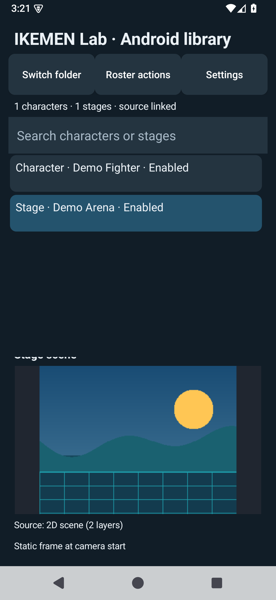

A supported 2D stage shows a static composition of two background layers.

## 0.6.0

These actual-app captures use a self-created demonstration library. They were captured from signed candidate `c0b38d9`; later recovery corrections did not change these screens. See the [0.6.0 prerelease](https://github.com/chillednems/IKEMEN-LAB/releases/tag/android-v0.6.0) for its APK and screenshots.

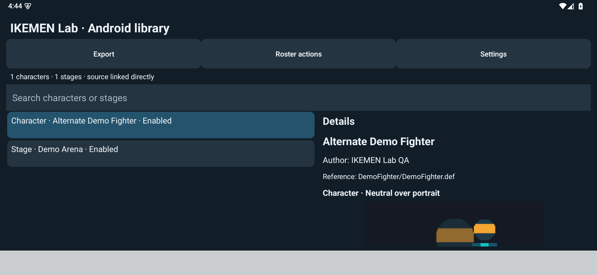

The main library browser keeps **Export** visible beside Roster actions and Settings.

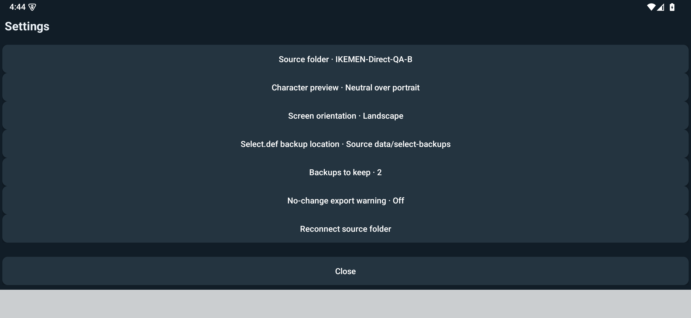

Settings shows the selected source, preview mode, orientation, backup destination, retention, and no-change warning.

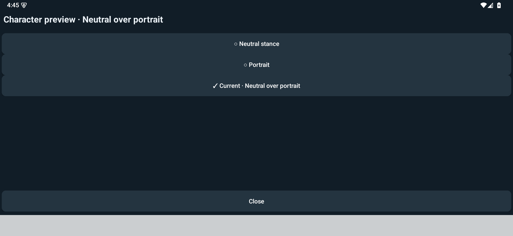

The preview setting marks **Neutral over portrait** as the current choice with a checkmark and text.

## Screenpack-aware roster (Android feature branch)

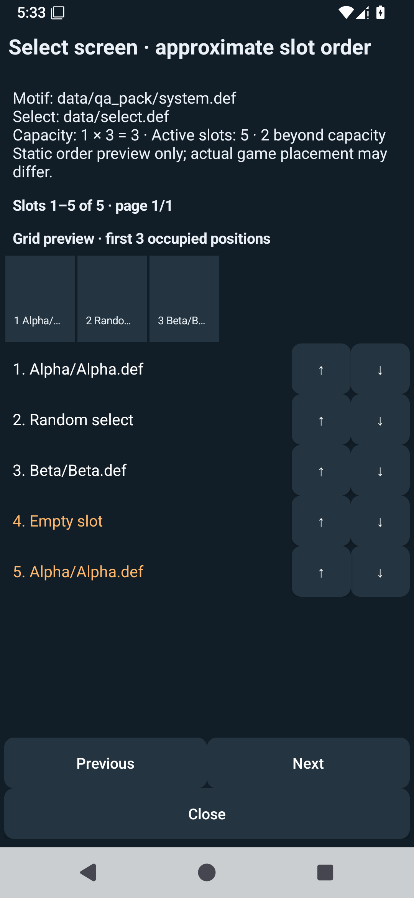

The static preview reads the active motif's select-screen capacity and shows the five occupied roster slots, including random and empty slots, with two beyond capacity. This is an approximate slot-order view; in-game placement may differ. The capture uses a self-created demonstration library and the tested `600f115` debug APK.

## Recycled Android browser (feature branch)

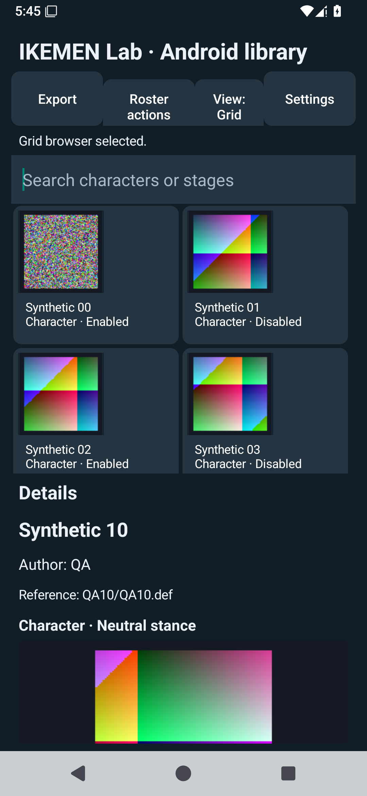

The grid displays visible character thumbnails from a self-created demonstration library and a selected item's details. The list/grid control preserves controller selection while switching views. Captured from the independently tested `b251c11` debug APK.

## Source facts and static input definitions (feature branch)

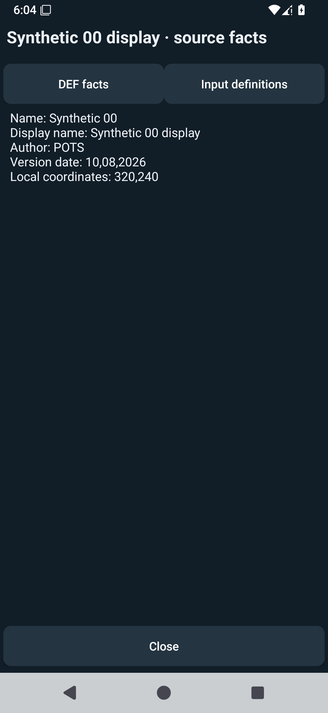

The facts view reads declared character metadata from a self-created DEF file. The [input definitions](android-metadata-cmd-synthetic.png) view lists static CMD labels and inputs without claiming verified playable moves. Both captures use the independently tested `a1cc773` debug APK; the later `Filter` toolbar wording change does not affect these views.

## Source-specific collections (feature branch)

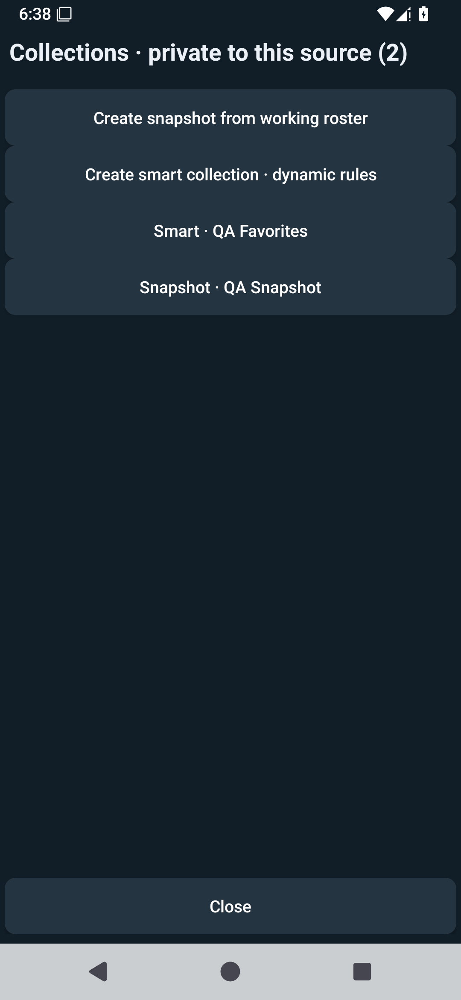

The private collection list shows a named snapshot and a dynamic smart collection for self-created demonstration content. The [activation review](android-collections-review-synthetic.png) shows the ordered character and stage counts and makes clear that activation changes the private working roster; the linked source requires a separate Export review. Both captures use the independently tested integrated `e80fbac` debug APK.

## Reviewed add-only import and health (feature branch)

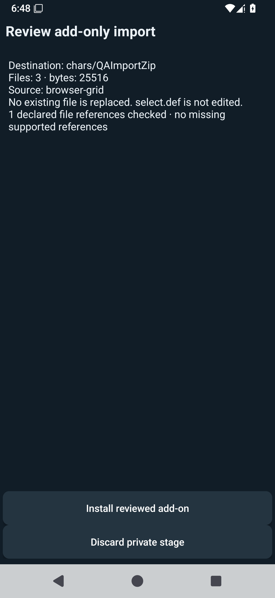

The import review names the add-on, file count, byte count, and supported reference result before any source write. A [blocked review](android-addon-import-blocked-synthetic.png) shows a missing required sprite and offers only discard. The [read-only stage health report](android-addon-stage-health-synthetic.png) shows the reference check without changing the roster. These synthetic captures use the independently tested `637ccf5` debug APK; the integrated `218a9a4` build changed only the previously tested **Filter** label.

## Shared ZIP and engine launch warning (feature branch)

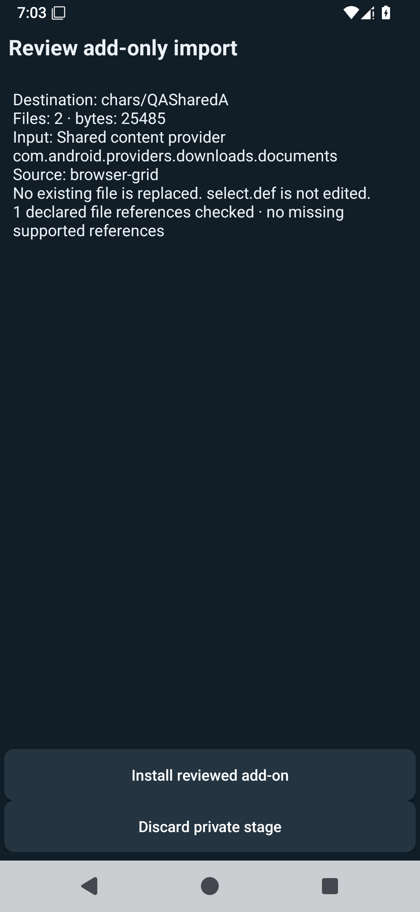

Android Files granted access to one synthetic ZIP, which entered the ordinary add-only review before installation. The [engine launch warning](android-engine-launch-warning-synthetic.png) explains that IKEMEN Lab passes no game folder or collection and the official v1 app may overwrite `select.def`. Both captures use the independently tested `8ddee27` debug APK; the integrated `7615a77` build changed only the previously tested **Filter** label.

## Experimental PNG static stage (feature branch)

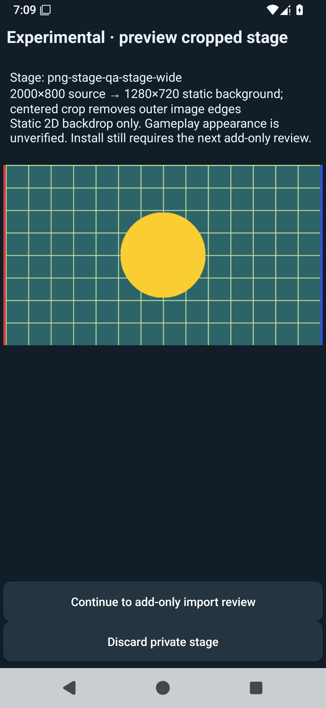

The pre-review preview names the crop and its experimental static-scene limit. The separate [add-only import review](android-png-stage-import-review-synthetic.png) names the destination, files, bytes, and supported reference check. The [installed stage](android-png-stage-installed-synthetic.png) appears as Unlisted with a thumbnail and static scene preview. The first two captures use the independently tested `80fbd0f` debug APK; the installed view uses the integrated `2b27334` debug APK. All artwork is synthetic, and in-game appearance remains unverified.
